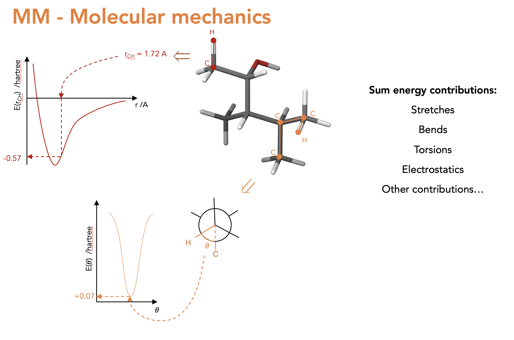
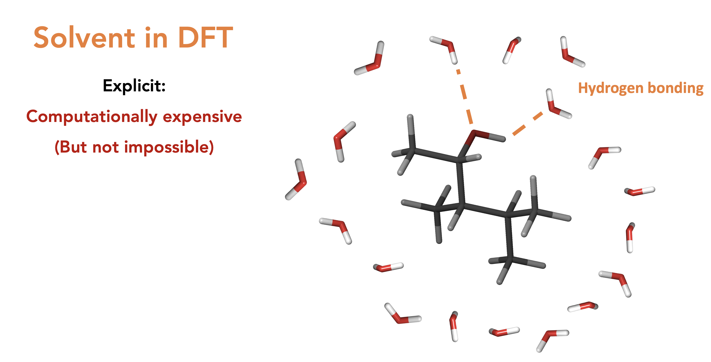

.. _ENRICH:

***************
ENRICH
***************

.. _ENRICH_explanation:

Theoretical basis for calculating NMR properties
=================================================

Magnetic shielding constants, referenced to TMS

.. _ave_for_equiv:

Averaging for equivalency
=================================================

Chemical shift averaging
NOE averaging (r^-6 / r^-3)

******************
Concept
******************

What we see by NMR is a boltzmann average over NMR timescales:

.. figure::  _static/concept_ave.png

Conceptual Workflow:

What is MM? (Not explicity part of auto-ENRICH but the structures we use as start points for DFT optimisations are from MM):

What is DFT?:

.. figure::  _static/concept_dft.png

Solvents in DFT, explicit then implicit. We always do implicit as explicit is too costly though we lose all localised effects such as hydrogen bonding. Also means that the chemical shifts of a proton that interacts with solvent is nonsense (You should do redundant conformer elimination on H's on alcohols and amines, ask someone why if you don't understand why)

.. figure::  _static/concept_imp_solv.png
